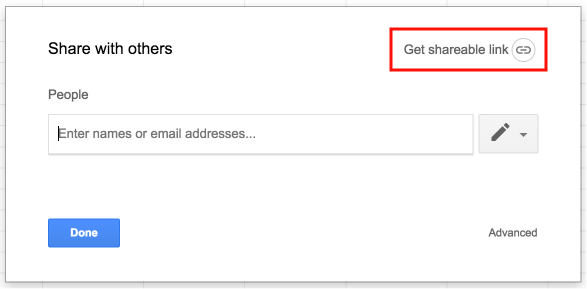
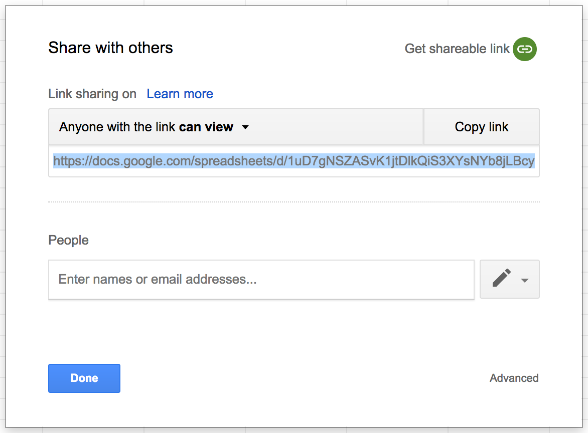

{{ site.title }} is a system for making timelines. It builds on the excellent work
done in the [Timeline JS](https://timeline.knightlab.com/) and
[vis.js](http://visjs.org/) projects to make a system for creating timelines
that can accommodate hundreds of entries. The goal is to provide a high-level
overview of large and complex timelines, without sacrificing detail and context.

  <iframe class="embedded-timeline" src="https://jaguillette.github.io/fabulousTime/timeline?tl_sheet=1hkZCGEEIeNusMHSHPOT30VgsgMVFQoTb0scEJixeEF4" height="800px" width="100%"></iframe>

<a href="https://jaguillette.github.io/fabulousTime/timeline?tl_sheet=1hkZCGEEIeNusMHSHPOT30VgsgMVFQoTb0scEJixeEF4" target="_blank">View in new window</a>

Your data is stored in a Google Sheet, and displayed on the web with Javascript.
The following tutorials will get you up and running with a new timeline, so that
you can add entries to the timeline and see how it changes.

# So, how do you want to work?

[I'm working on my own timeline](#solo)

[I want to make a collaborative timeline](#collab)

<h2 id="solo">Making Your Own Timeline</h2>

### Setting up your spreadsheet

Start with the spreadsheet template from Timeline JS, which you can get a copy of in your Google Drive by clicking [this link](https://docs.google.com/spreadsheets/d/1pHBvXN7nmGkiG8uQSUB82eNlnL8xHu6kydzH_-eguHQ/copy).

For information on working with your spreadsheet, see the [Timeline JS help documentation](https://timeline.knightlab.com/#help).

One added feature in {{ site.title }} is the ability to add tags to your sheet, which can then be used to filter entries on your timeline. Entries in the tag column will be split on commas, allowing you to have as many tags as you want.

You can call your tag column anything you want, just don't change the column name after you've set up the display.

You can add a tag column to your Google Sheet, but for now the important thing to know is that the information in your spreadsheet will be translated into the timeline display.

For your timeline to be used by {{ site.title }}, it must be set to be viewable by anyone with the sharing link.

To enable this sharing link, click on the share button in the top right when editing your spreadsheet: 

Then click on "Get shareable link" to enable link sharing

Google copies the link to your clipboard automatically, so you're all set when you see a screen like this one:

### Setting up your timeline display

Paste the sharing link for your Google Sheet here:

<input class="timeline-setup-text-input" type="text" name="sharing-link" id="sharing-link-input"/>

If you've set up a tag column, enter its name here:

<input class="timeline-setup-text-input" type="text" name="tag-column" id="tag-column-input"/>

Now click this link:

<a href="#" target="_blank" id="display_link">Your link will appear here</a>

...and bookmark the page. This is the timeline display for your spreadsheet.

Now you can edit the data in your spreadsheet, and simply refresh the page of your timeline display to see the changes take place. You can share that link around to show off your timeline, although it might be nice to put it behind a link shortener like [bit.ly](http://bit.ly) or [goo.gl](http://goo.gl).

<h2 id="collab">Making a Collaborative Timeline</h2>

Collaborative timelines require more setup than a solo project, but these instructions and some templates will make it pretty simple and manageable.

The general flow of a collaborative timeline still uses Google Sheets to store the timeline data, but instead of having every contributor edit the Google Sheet directly, timeline entries can be added through a Google Form, and edited via a link that each contributor will receive.

### Setting Up the Input Form and Spreadsheet

The first step is to make a copy of [this form template](https://docs.google.com/a/g.harvard.edu/forms/d/1hk22A332STnIsGJUfx4MNLSBl0Q2I1JqxbijOzuLyBU/copy).

Before you make any changes to the form, you need to make sure that the sheet for accepting responses is set up. While editing the form, click over to Responses...

...and click the green Google Sheets icon to create a spreadsheet to contain the responses.

When you've created that spreadsheet, you'll need to set the sharing permissions so that anyone with a link can view the sheet.

To enable this sharing link, click on the share button in the top right when editing your spreadsheet: 

Then click on "Get shareable link" to enable link sharing

Google copies the link to your clipboard automatically, so you're all set when you see a screen like this one:

### Setting up your timeline display

Paste the sharing link for your Google Sheet here:

<input class="timeline-setup-text-input" type="text" name="sharing-link" id="sharing-link-input"/>

If you've set up a tag column, enter its name here:

<input class="timeline-setup-text-input" type="text" name="tag-column" id="tag-column-input"/>

Now click this link:

<a href="#" target="_blank" id="display_link">Your link will appear here</a>

...and bookmark the page. This is the timeline display for your form and spreadsheet. You can use the form for input by emailing links or embedding the form right into your website, and then view and manage responses in the Google Sheet, which you as the owner are able to edit.

### How Contributors Will Add Entries

You can distribute your Google Form in a variety of ways (see [Google help article](https://support.google.com/docs/answer/2839588)), but however your contributors view the form, what happens when they submit will be the same.

Their entry will be recorded as a row on the Google Sheet that you set up, so it will appear as an entry on the timeline. As the spreadsheet owner, you can go in and edit any entry (which you may have to do to fix contributor errors).

With the default setup, contributors will provide their emails, and then receive a confirmation email upon submitting their entry via the form. The confirmation email will contain a link to edit the entry, so that contributors can go back and fix errors that they realize later.

The changes they made will be immediately visible, so it's a good idea to have a link to your timeline in the confirmation message at the end of the survey.

The confirmation email and editing capabilities for contributors can be disabled through the Google Form, they are simply enabled by default for convenience.

### Collaborative Timeline Considerations

When accepting input from a variety of contributors, it can be helpful to make some decisions about what you want the end product to look like up front. With my experience seeing collaborative timelines implemented in classrooms, I've noticed some things you may want to consider as you set up your project.

#### Representation of Time

It's a good idea to give contributors an idea of how to represent events and periods of time. For example, if contributors may add a person to the timeline, how should the person be represented? Should they get a timespan from their birth to their death? A single point at a moment in their life? If an event lasted 3 days, does it make sense to show it as a span of time, or just a single date? Having consistency in how parts of the timeline are represented will make for an end result that's easier to understand.

#### Group and Tag Vocabulary

It's likely that you'll want to restrict the groups available for timeline, and possibly the tags. This is easy to set up in the Google Form with multiple choice question types, and can make it easier for visitors to understand your timeline, and to see trends in it. Especially with tags, you'll want to strike a balance between expressivity and consistency.

#### Removing Unnecessary Questions

Simply put, the simpler the form, the more consistent your responses will be, and the easier to manage the timeline will be. Maybe you don't want to deal with questions of timespan at all, so you remove all of the end date questions. Maybe multimedia content doesn't suit your needs, so you want to remove all of the questions related to that. Whatever your needs are, don't be afraid to trim the fat from the form template to make life easier for your contributors and yourself.

